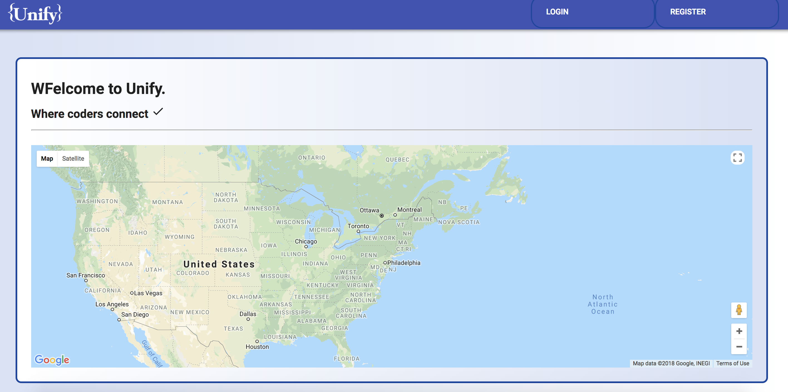
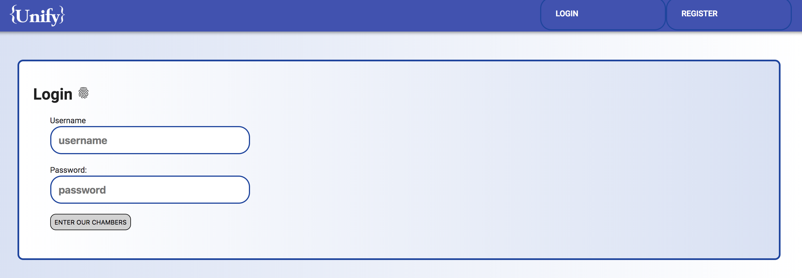

Unify - Where coders connect

An app created using ReactJS, MongoDB, Passport for Authentication

The basic idea of this app is to make the coders share their opinions and career related views, obstacles they face in the job.

Login/Signup uses Passport authentication, where user can signup or login and enter the app and post their views.

Search option is available for users to search others based on the technologies and connect with them by sending out a mail personally with a message in it.

Update button is used to update the user info in case the user has updated his/her knowledge in a particular technology they can update it on their Profile.

Delete button is used to delete the account of the user.

Google Maps are used to identify User location represented by pins on the maps.

Demo

